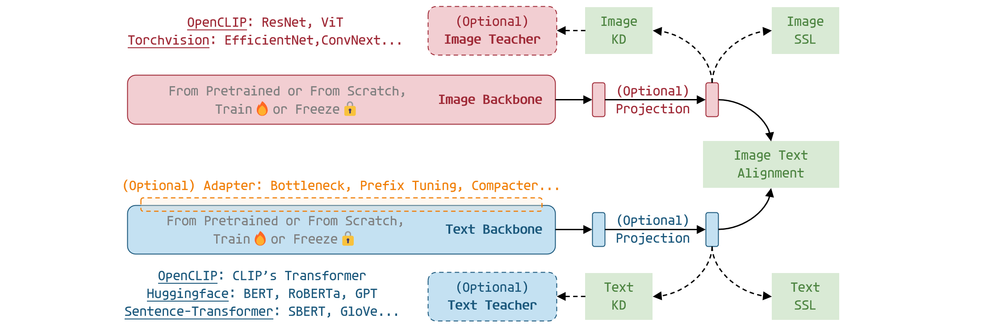

.. ITRA documentation master file, created by
   sphinx-quickstart on Fri Nov 18 11:15:19 2022.
   You can adapt this file completely to your liking, but it should at least
   contain the root `toctree` directive.

Welcome to the docmentation of ITRA ! 🎈
================================

``ITRA`` (abbreviation for Image Text Representation Alignment) is a codebase for flexible and efficient vision language learning.

.. note::
   ``ITRA`` is an ongoing project and its codes are still under development. A temporary repository of the codebase is located at: https://github.com/ChenDelong1999/ProtoRKD

.. toctree::
   :maxdepth: 3
   :caption: Introduction

   Contents/introduction/overview
   Contents/introduction/related-work
   Contents/introduction/change-log

.. toctree::
   :maxdepth: 3
   :caption: Getting Started

   Contents/getting-started/install-dependencies
   Contents/getting-started/prepare-data

.. toctree::
   :maxdepth: 3
   :caption: User Guide

   Contents/user-guide/load-pretrained-multi-modal-weights
   Contents/user-guide/load-pretrained-uni-modal-weights
   Contents/user-guide/training-data
   Contents/user-guide/loss-functions
   Contents/user-guide/use-adapters

.. toctree::
   :maxdepth: 3
   :caption: Example Usage

   Contents/example-usage/clip-finetuning
   Contents/example-usage/unicl-image-classification
   Contents/example-usage/eval-only
   Contents/example-usage/clip-pretraining

.. todo::
   - Method Supports
         - MIM and FLIP support
         - UniCL support
         - SSL Image Augmentations
         - Loading face encoder as image backbone
         - Loading LLMs (OPT, PaLM) as text backbone
         - ProtoCLIP implementation
         - Verify the implementation of other loss functions
         - Verify NLP evaluations (STS-B, MS-Marco, etc.)

   - Documentation
         - SimCSE and PromptBERT re-implementation
         - Vision-to-language Knowledge Distillation
         - Language-to-vision Knowledge Distillation
         - Teacher selection based on Information Bottleneck Theory
         - Chinese CLIPs' Evaluation Reports (ImageNet-CN zero-shot, MC-COCO-CN retrieval)