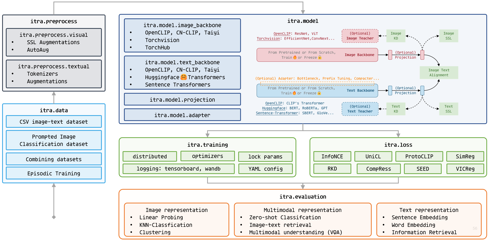

.. ITRA documentation master file, created by
   sphinx-quickstart on Fri Nov 18 11:15:19 2022.
   You can adapt this file completely to your liking, but it should at least
   contain the root `toctree` directive.

Welcome to the documentation of ITRA ! 🎈
================================

``ITRA`` (abbreviation for Image Text Representation Alignment) is a codebase for flexible and efficient vision language learning. ``ITRA`` features a unified interface to easily access state-of-the-art pretrained models, adapters, loss functions from various sources.

.. image:: ../source/Contents/assets/pipeline.png
   :align: right
   :width: 10in

``ITRA`` supports training, evaluation and benchmarking on a rich variety of tasks, including zero-shot/k-NN/linear classification, retrieval, word embedding and sentence embedding evaluation. In the meantime, ``ITRA`` is also highly modular extensible and configurable, facilitating future development and customization.

.. Important::
   ``ITRA`` is an ongoing project and its codes are still under development. A temporary repository of the codebase is located at: https://github.com/ChenDelong1999/ITRA

.. note::
   If you find any bugs or have any recommendations for building ``ITRA``, please raise a issue in the repo, thanks~

.. toctree::
   :maxdepth: 3
   :caption: Introduction

   Contents/introduction/overview
   Contents/introduction/related-work
   Contents/introduction/change-log

.. toctree::
   :maxdepth: 3
   :caption: Getting Started

   Contents/getting-started/install-dependencies
   Contents/getting-started/prepare-data

.. toctree::
   :maxdepth: 3
   :caption: User Guide

   Contents/user-guide/load-pretrained-multi-modal-weights
   Contents/user-guide/load-pretrained-uni-modal-weights
   Contents/user-guide/training-data
   Contents/user-guide/loss-functions
   Contents/user-guide/use-adapters
   Contents/user-guide/freeze-parameters

.. toctree::
   :maxdepth: 3
   :caption: Example Usage

   Contents/example-usage/eval-only
   Contents/example-usage/clip-pretraining
   Contents/example-usage/clip-finetuning
   Contents/example-usage/unicl-image-classification
   Contents/example-usage/language-to-vision-KD
   Contents/example-usage/vision-to-language-KD

.. todo::
   New features incoming👇

   - Refract main.py
   - Write help messages for arguments
   - Use YAML
   - Project
        - install as package
        - Pypi package publishing
   - Evaluation reports
        - zero-shot classification
        - linear/knn classification
        - clustering evaluation
        - SentEval
        - word embedding
        - MS Marco retrieval
        - Chinese CLIPs' Evaluation Reports (ImageNet-CN zero-shot, MC-COCO-CN retrieval)
   - Implementations
        - UniCL-based image classification
        - Validate loss functions
        - Validate Adapters
        - SimCSE and PromptBERT re-implementation
        - Vision-to-language Knowledge Distillation
        - Language-to-vision Knowledge Distillation
        - Teacher selection based on Information Bottleneck Theory

